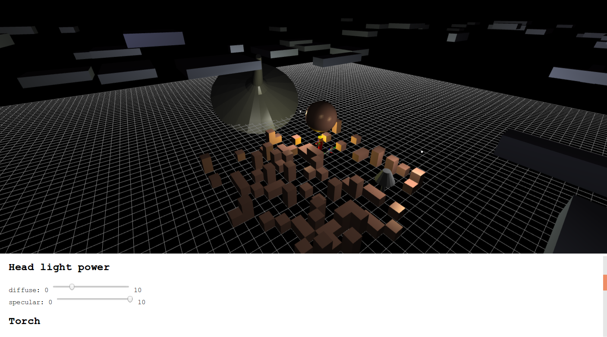

=====
steve
=====

A computer graphics course project.

Gameplay
========

-   ``V`` to switch between third person, first person and free fly camera
-   in third person and first person camera, ``W, S`` to make Steve walk forward or backward; ``Shift`` to bow; ``Space`` to jump
-   Mouse drag to rotate view angles; mouse wheel scroll to scale camera distance

Graphics-related controls
=========================

-   switch seamlessly between 2 shading methods: Phong shading and Gouraud shading, and between 2 lighting methods: Phong lighting and Blinn-Phong lighting
-   ambient light power control in RGB channels
-   camera head light diffuse and specular term control
-   torch on/off

Quick start
===========

1.  clone this project
2.  install dependencies

    .. code-block:: bash

        npm install

3.  run

    .. code-block:: bash

        npm run test

4.  go to ``localhost:1234``

Generate course report
======================

Course report is written in reStructuredText and built in Sphinx.

1.  set up a Python virtual environment (recommended)

    .. code-block:: bash

        python3 -m venv env
        source env/bin/activate

2.  install sphinx

    .. code-block:: bash

        python3 -m pip install sphinx

3.  build

    .. code-block:: bash

        cd docs
        make latexpdf

PDF at ``docs/_build/latex/steve.pdf``.

About ``engine.ts``
===================

A simple home-made wrapper around WebGL's drawing primitives. Inspired by pygame and three.js.

Hello world
-----------

Bind canvas

.. code-block:: typescript

    let canvas = document.querySelector("canvas")
    let renderer = new Renderer(canvas);

Create a gold sphere with Phong shading, Phong lighting

.. code-block:: typescript

    let goldMaterial = new PhongShadingPhongLightingMaterial(
        [0.35, 0.24, 0.19, 1.0],
        [0.702, 0.482, 0.384, 1],
        [0.628281, 0.555802, 0.366065, 1.0],
        [0, 0, 0, 1],
        [51.2, 51.2, 51.2, 51.2],
    );
    let sphereGeometry = new SphereGeometry(2, 32, 32);
    let sphere = new Sprite(sphereGeometry, goldMaterial);

Create a point light, put it at ``5, 0, 5``

.. code-block:: typescript

    let light = new PointLight([3, 3, 0, 1], [3, 3, 0, 1]);
    mat4.translate(light.modelMatrix, light.modelMatrix, [5, 0, 5]);

Create a camera, place it at ``5, 5, 5``, looking at origin, heading up

.. code-block:: typescript

    let camera = new PerspectiveCamera(
        [5, 5, 5],
        [0, 0, 0],
        [0, 0, 1],
        radians(60),
        canvas.width / canvas.height,
        0.1,
        100,
    );

Construct the scene

.. code-block:: typescript

    let world = new Sprite(null, null);
    world.add(sphere);
    world.add(light);

Render the scene repeatedly

.. code-block:: typescript

    function onDraw() {
        renderer.render(world, camera);

        requestAnimationFrame(onDraw);
    }

    onDraw();