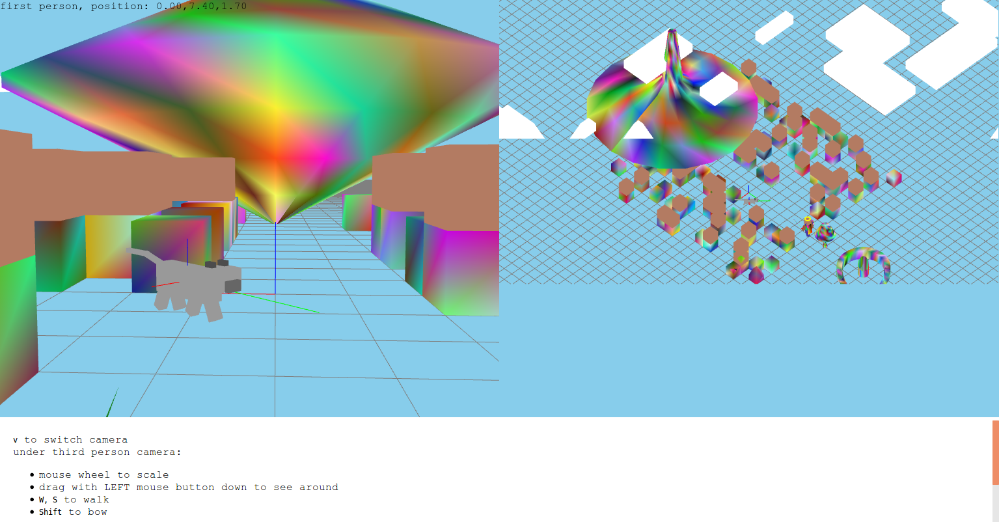
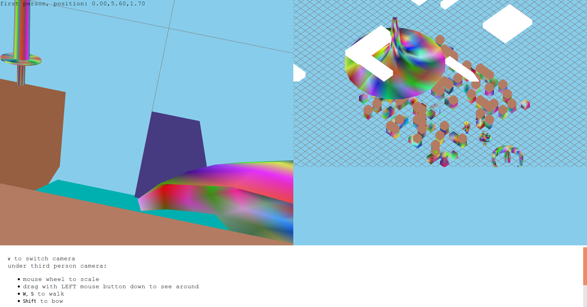
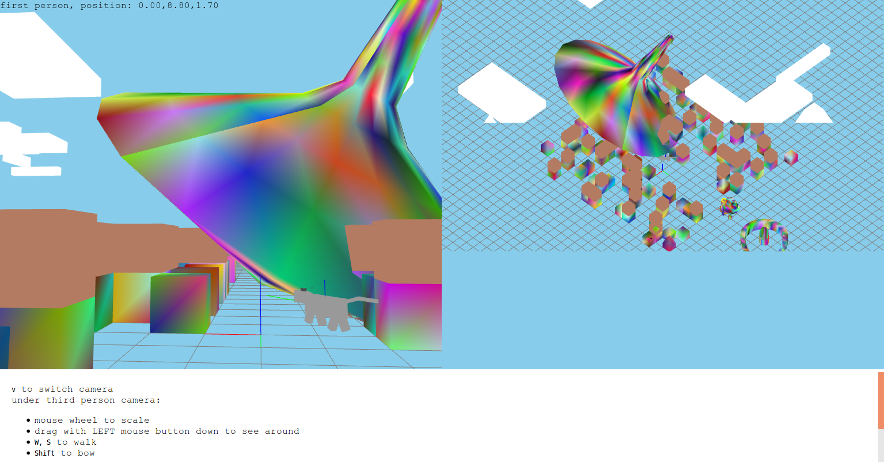
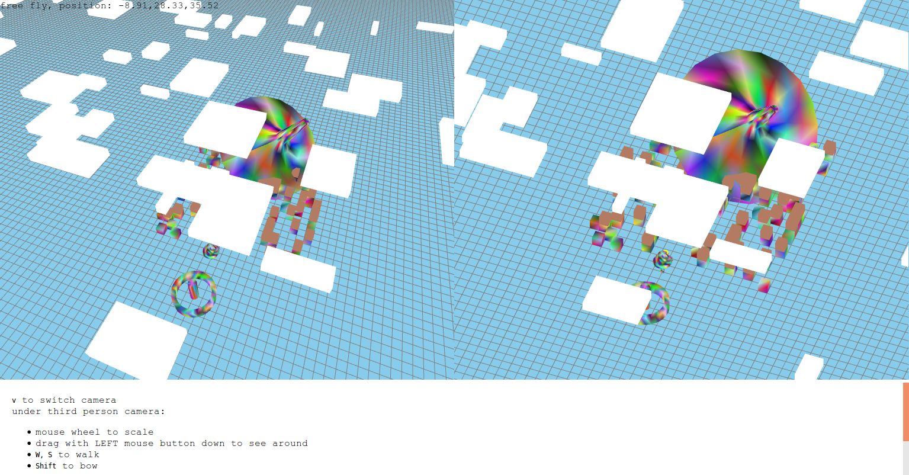

=======================
Project B Documentation
=======================

Quick start
===========

A pre-built version has been put in the root directory, and you can simply drag ``index.html`` and drop it into the browser window to run the project.

User guide
==========

Mouse usage

-   In third person camera, scroll mouse wheel to zoom in and out
-   In any camera mode, hold down mouse left button and drag mouse to change view angles
-   In any camera mode, hold down mouse right button and drag mouse to rotate the giant gyro

Keyboard usage

-   In third person and first person camera, press ``W`` to let Steve walk forward, press ``S`` to let Steve walk backward, press left ``Shift`` to let Steve bow, and press ``Space`` to let Steve jump
-   In free-fly camera, press ``W`` to fly the camera towards look-at position, press ``S`` to fly the camera away from look-at position, press ``Shift`` to elevate, press ``Ctrl`` to decrease height, press ``A`` to fly leftward (does not change height), and press ``D`` to fly rightward (does not change height either)

All these keys are independent and can be combined together, i.e. you can make Steve jump while walking and bowing, and you can fly leftward while elevating!

Demo
====

.. _fig-original:
.. figure:: fig-original.png
    :width: 100%

    Initial scene. The canvas is split into two evenly-separated viewports: left viewport is a perspective camera's view, and right viewport is an orthographical camera's view. The canvas's height is strictly 80% of the browser window. On the upper-left corner, there is a tag saying ``third person, position: x, y, z`` indicating that current camera is a third person camera that rotates and is centered round steve and wherever Steve goes, third camera will always follow him. Hold down left mouse button and drag, third camera will rotate view angles but do not change look-at position. On the bottom 20%, user instructions are presented. A nearly infinite ground grid that extends to the horizon can be seen easily. World axes are fixed at origin. On steve's shoulder, a joint axes are placed to help clarify model transforms.

.. _fig-walk:
.. figure:: fig-walk.png
    :width: 100%

    Press ``W`` and Steve will walk forward. His arms and legs will rotate around the joint naturally. Press ``S`` to let Steve walk backward. Steve now holds a shield and sword in his hands. Behind his back, there is a custom-designed tree and an altar. The shield and sword is painted with per-vertex varying colors. Also notice that right orthographical view does not change when current camera is a third person or a first person camera: it will only change according to left view angles when current camera is a free-fly camera.

.. _fig-first-person-camera:

    When in third person camera, press ``V`` and current camera will become a first person camera. It is like attaching the camera to Steve's eyes.

.. _fig-first-person-camera-looking-down:

    You can look down in the first person camera, and see how Steve walks.

.. _fig-quaternion:

    In any camera, you can always hold right mouse button down and drag to rotate the gyro. Rotation of gyro is done using quaternion multiplication and the rotation is always with respect to current view plane. Try pulling the gyro down and rotate.

.. _fig-free-fly:

    Free-fly camera mode. Orthographical view on the right side will change accordingly when you change view angles.

Behind the scene
================

The scene graph is shown at :numref:`fig-scene-graph`.

.. _fig-scene-graph:
.. figure:: scene_graph.png
    :width: 100%

    Scene graph. User controlled and animated movement transformation is not drawn on the scene graph. For example, mouse and mouse-wheel controls view angles and viewport scale by applying a matrix to ``world``. Steve's arm, leg and body movement are implemented by applying a matrix to their ``Joint`` sprites. The cat's front and rear leg movement are also implemented by applying a matrix to their ``Joint`` sprites.