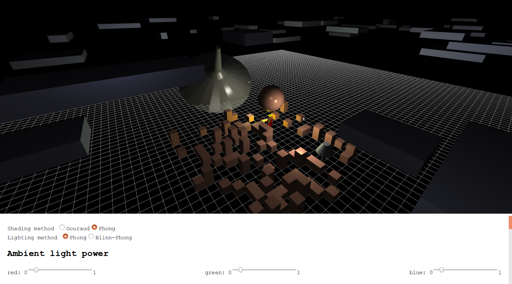
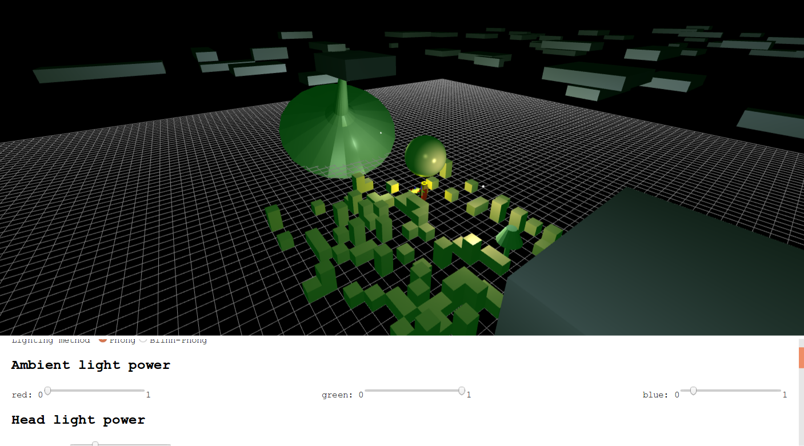
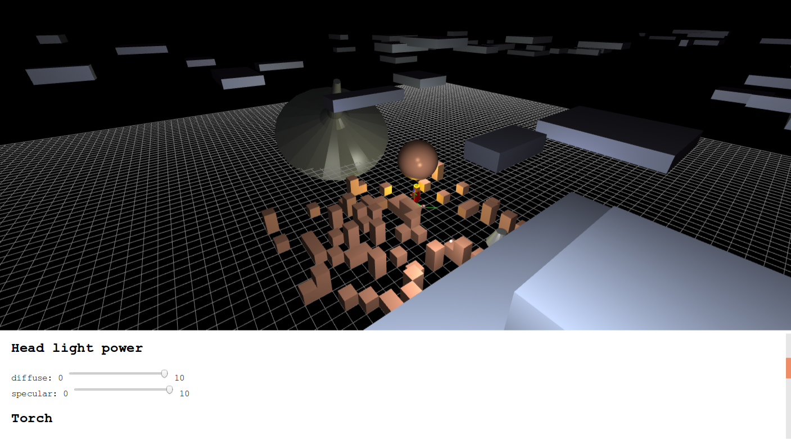

=======================
Project C Documentation
=======================

Quick start
===========

A pre-built version has been put in the root directory, and you can simply drag ``index.html`` and drop it into the browser window to run the project.

User guide
==========

Mouse usage

-   In third person camera, scroll mouse wheel to zoom in and out
-   In any camera mode, hold down mouse left button and drag mouse to change view angles
-   In any camera mode, hold down mouse right button and drag mouse to rotate the giant gyro

Keyboard usage

-   In third person and first person camera, press ``W`` to let Steve walk forward, press ``S`` to let Steve walk backward, press left ``Shift`` to let Steve bow, and press ``Space`` to let Steve jump
-   In free-fly camera, press ``W`` to fly the camera towards look-at position, press ``S`` to fly the camera away from look-at position, press ``Shift`` to elevate, press ``Ctrl`` to decrease height, press ``A`` to fly leftward (does not change height), and press ``D`` to fly rightward (does not change height either)

All these keys are independent and can be combined together, i.e. you can make Steve jump while walking and bowing, and you can fly leftward while elevating!

Demo
====

.. _fig-original:
.. figure:: fig-original.png
    :width: 100%

    Initial scene. The canvas's height is strictly 80% of the browser window. A nearly infinite ground grid with white lines that extends to the horizon can be seen easily. There are more than 3 objects in the scene: a rotating gold sphere at the center to reveal the correctness of surface normals, a mouse-rotatable, pewter gyro, Steve, cat, silver clouds and randomly generated gold cubes.

.. _fig-shading-lighting-method-switch:

    On the lower 20% of the browser window, you can control shading methods and lighting methods, on the go, without interrupting the program [#interrupt]_ or requiring restarting the program. The figure shows the scene in Phong shading and Phong lighting. Also in this figure, a highlight spot, on the sphere, caused by camera head light, can be seen.

.. _fig-ambient-light-switch:

    Ambient light power is adjustable independently on each RGB channel.

.. _fig-head-light-switch:

    Head light power is adjustable independently on the diffuse term and specular term.

.. _fig-torch:

    Torch can be turned on and off.

.. _fig-steve-waving:

    Torch light position is user-adjustable. It is exactly attached to the top of the torch, so you can make Steve walk to change its position. The upper sub-figure shows that when Steve's left hand is on the back side, torch light will be obscured by his body, so his head and the cat before him are in dark. The lower sub-figure shows that when Steve's left hand is on the forward side, torch light is not obscured, and his whole body is lit. This reflects the fact that torch light is indeed attached to the top of the torch, conforming reality.

.. [#interrupt] Changing the shading method or lighting method actually requires switching shaders. The project takes a lazy-load, load-on-demand approach: unless you explicitly change to a different shading or lighting method, new shaders will never be compiled, in order to save initial loading time. Once compiled, shader programs will stay cached, and next time you switch to that shading or lighting method, no re-compilation is needed any more. Depending on your PC's hardware, compilation might take noticeable time to complete, during which you may notice a 1-2 second unresponsive freeze.

Behind the scene
================

The scene graph is shown at :numref:`fig-scene-graph`.

.. _fig-scene-graph:
.. figure:: scene_graph.svg
    :width: 100%

    Scene graph. View-specific transforms are applied to view matrix, projection matrix and viewport matrix and do not touch model matrices at all. Only rotation of the gyro is done by changing its model matrix (with quaternion).