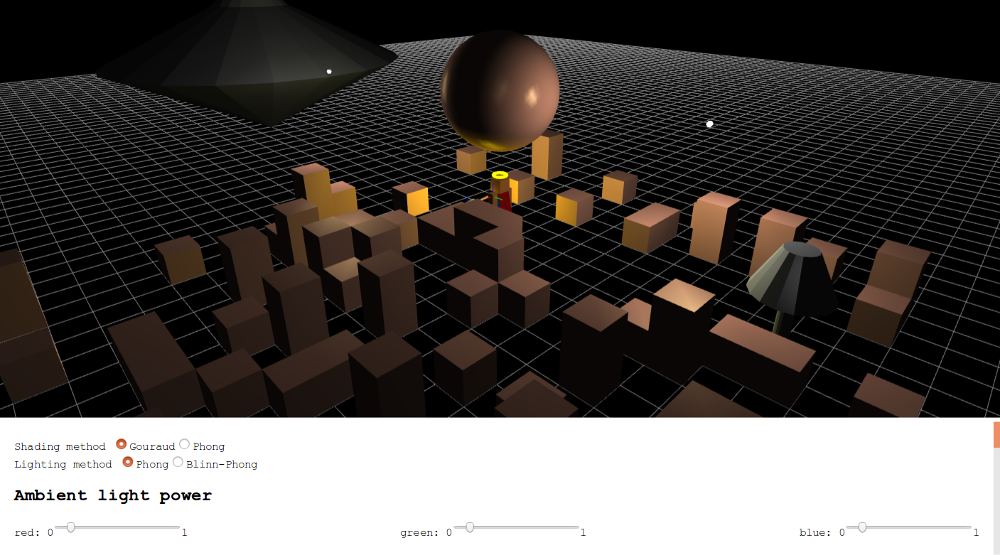

=======================
Project A Documentation
=======================

Quick start
===========

A pre-built version has been put in the root directory, and you can simply drag ``index.html`` and drop it into the browser window to run the project.

User guide
==========

Mouse usage

-   Scroll mouse wheel to zoom in and out
-   Press mouse left button and drag mouse to change view angles

Keyboard usage

-   Press ``W`` to let Steve walk forward
-   Press ``S`` to let Steve walk backward
-   Press left ``Shift`` to let Steve bow
-   Press ``Space`` to let Steve jump

All these keys are independent and can be combined together, i.e. you can make Steve jump while walking and bowing!

Demo
====

:numref:`fig-original`, :numref:`fig-mousedrag`, :numref:`fig-mousewheel`, :numref:`fig-walk` and :numref:`fig-bend` are screenshots of the project.

.. _fig-original:

    Initial scene. The cat will walk around the origin forever, with its tail rotating up and down. The red wool ball on Steve's left hand is a sphere. The halo ring above Steve's head is a torus.

.. _fig-mousedrag:
.. figure:: fig-mousedrag.png
    :width: 100%

    Mouse drag to change view angles. The cape on Steve's back is colored with smoothly-varying per-vertex random colors and its rotating trajectory is a sine wave.

.. _fig-mousewheel:

    Scroll mouse wheel to zoom in and out.

.. _fig-walk:
.. figure:: fig-walk.png
    :width: 100%

    Press ``W`` and Steve will walk forward. His arms and legs will rotate around the joint naturally. Press ``S`` to let Steve walk backward.

.. _fig-bend:
.. figure:: fig-bend.png
    :width: 100%

    Press left ``Shift`` and Steve will bow.

Behind the scene
================

The scene graph is shown at :numref:`fig-scene-graph`.

.. _fig-scene-graph:
.. figure:: scene_graph.png
    :width: 100%

    Scene graph. User controlled and animated movement transformation is not drawn on the scene graph. For example, mouse and mouse-wheel controls view angles and viewport scale by applying a matrix to ``world``. Steve's arm, leg and body movement are implemented by applying a matrix to their ``Joint`` sprites. The cat's front and rear leg movement are also implemented by applying a matrix to their ``Joint`` sprites.